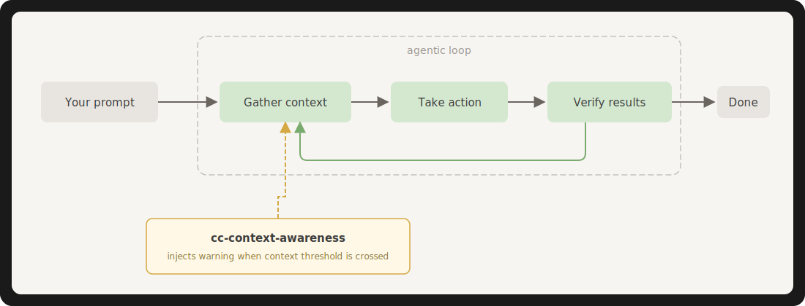

# cc-context-awareness

Deterministic context awareness for [Claude Code](https://docs.anthropic.com/en/docs/claude-code). Enhances the built-in context tracking with configurable thresholds and custom instruction injection — trigger workflows, save state, or steer Claude's behavior based on live usage.

<p align="center">
  
</p>

## Quick Install

**Local install** (per-project, default):
```bash
curl -fsSL https://raw.githubusercontent.com/sdi2200262/cc-context-awareness/main/install.sh | bash
```

**Global install** (all projects):
```bash
curl -fsSL https://raw.githubusercontent.com/sdi2200262/cc-context-awareness/main/install.sh | bash -s -- --global
```

| Mode | Scripts | Settings | Use case |
|------|---------|----------|----------|
| Local (default) | `./.claude/cc-context-awareness/` | `./.claude/settings.local.json` | Different thresholds per project |
| Global | `~/.claude/cc-context-awareness/` | `~/.claude/settings.json` | Same config everywhere |

**Priority:** Local settings override global. If you have both installed, the local config is used in that project.

Or clone and install:

```bash
git clone https://github.com/sdi2200262/cc-context-awareness.git
cd cc-context-awareness
./install.sh           # local (this project)
./install.sh --global  # global (all projects)
```

Restart Claude Code after installing.

### Install Options

| Flag | Effect |
|------|--------|
| `--global` | Install globally to `~/.claude/` instead of locally to `./.claude/` |
| `--overwrite` | Replace an existing `statusLine` config (see [Handling Conflicts](#handling-conflicts)) |
| `--no-skill` | Skip the agent skill; install a standalone configuration guide instead |
| `--hook-event <event>` | Hook event for context injection. Default: `PreToolUse`. Also accepts `PostToolUse`, `UserPromptSubmit` |

### Requirements

- [Claude Code](https://docs.anthropic.com/en/docs/claude-code)
- [`jq`](https://jqlang.github.io/jq/download/) — install with `brew install jq` (macOS) or `sudo apt-get install jq` (Ubuntu)

## What It Does

**Context-aware steering** — When context usage crosses a configurable threshold, custom instructions are injected directly into Claude's conversation. Use this to trigger pre-compaction workflows, save session state, change behavior, or prompt Claude to wrap up before it's too late.

**Visual feedback** (optional) — A status line shows live context usage at the bottom of your Claude Code session:

```
context ████████████░░░░░░░░ 60%        (normal — white)
context ████████████████░░░░ 82%        (warning — red)
```

## Enhancing Claude Code's Built-in Mechanism

Claude Code has built-in context awareness — token counts after each tool call, a UI meter, and a warning at 20% remaining. But it's hardcoded. You can't change the threshold, add multiple tiers, or inject custom instructions.

| | Claude Code built-in | cc-context-awareness |
|---|---|---|
| Thresholds | Hardcoded (20% remaining) | Fully configurable |
| Multiple tiers | No | Yes (e.g. 60%, 80%, 95%) |
| Custom messages | No | Yes — inject any instruction |
| Trigger workflows | No | Yes — pre-compaction saves, behavioral changes |

Configurable thresholds are a [commonly](https://github.com/anthropics/claude-code/issues/14258) [requested](https://github.com/anthropics/claude-code/issues/11819) [feature](https://github.com/anthropics/claude-code/issues/6621) not yet available natively.

## How It Works

The goal is to inject custom instructions into Claude's conversation when context thresholds are crossed. Claude Code's extension points don't support this directly, so cc-context-awareness bridges two mechanisms:

1. **Status line** — receives context window data after each assistant message, checks thresholds, writes a flag file when triggered
2. **Hook** — runs before each tool call, reads the flag file, injects the message as `additionalContext` into Claude's conversation
3. **Reset handler** — runs on `SessionStart` after `/compact` or auto-compaction, clears stale flag files so the post-compaction agent starts with a clean state

This happens inside the agentic loop — Claude receives your custom instructions mid-task, not just at the end. Flag files are session-scoped (`/tmp/.cc-ctx-trigger-{session_id}`), so multiple Claude Code instances don't interfere.

### Compaction handling

When `/compact` (or auto-compaction) fires, the `session_id` stays the same but context usage drops sharply. Without cleanup, a stale trigger file from before compaction would inject an outdated high-usage warning into the fresh post-compaction agent. The `SessionStart` reset handler prevents this by deleting both the trigger and fired-tier tracking files on the compaction boundary.

### Hook event options

| Event | When it fires | Trade-off |
|-------|--------------|-----------|
| `PreToolUse` | Before every tool call | Mid-loop coverage. Runs frequently — adds ~25ms per tool call. **Default.** |
| `PostToolUse` | After every tool call | Same coverage, fires after instead of before. |
| `UserPromptSubmit` | Once per user prompt | Zero overhead during agentic loops, but no mid-loop coverage. |

Switch with: `./install.sh --hook-event <event>`

## Handling Conflicts

### Merging with other statusLine tools

Claude Code only supports **one** `statusLine` command. If you're using another statusline tool like [ccstatusline](https://github.com/sirmalloc/ccstatusline), cc-context-awareness can work alongside it — you just need to ensure the flag-writing logic runs.

**Option 1: Wrap (recommended)**

Create a wrapper script that calls both:

```bash
#!/usr/bin/env bash
# ~/.claude/statusline-wrapper.sh
INPUT=$(cat)
echo "$INPUT" | /path/to/other/statusline.sh
echo "$INPUT" | ~/.claude/cc-context-awareness/context-awareness-statusline.sh
```

Point your `settings.json` at the wrapper:
```json
{"statusLine": {"type": "command", "command": "~/.claude/statusline-wrapper.sh"}}
```

**ccstatusline users:** If you use [ccstatusline](https://github.com/sirmalloc/ccstatusline), replace `/path/to/other/statusline.sh` with `bunx ccstatusline@latest` (or `npx ccstatusline@latest`). Since ccstatusline already has a `ContextPercentage` widget, you can hide the cc-context-awareness bar by redirecting its output: `echo "$INPUT" | ~/.claude/cc-context-awareness/context-awareness-statusline.sh > /dev/null`. This keeps the flag-writing active without duplicating the context display.

**Option 2: Merge**

Copy the flag-writing logic from our statusline script into yours. The critical part is writing to `/tmp/.cc-ctx-trigger-{session_id}` when thresholds are crossed — the hook reads this file.

**Installer behavior:**

- **No existing statusLine**: Adds ours automatically
- **Another tool's statusLine**: Prints merge instructions, does **not** modify `settings.json`
- **`--overwrite` flag**: Replaces the existing statusLine with ours

### Hooks

Hooks are **additive** — Claude Code supports multiple hook entries per event. The installer:

- Appends our hook to any existing hook array (never replaces other hooks)
- Checks for duplicates before appending (safe to re-run)
- On uninstall, removes only our entry and leaves others intact

### Settings.json validation

If `settings.json` exists but contains invalid JSON, the installer will:

- Print an error message
- Still install the scripts (so you can fix settings.json and re-run)
- Exit without modifying the broken file

## Use Cases

<details>

These examples leverage the core benefit: **deterministic steering**. Claude receives real context data, not guesses — so your instructions can be precise, whether you're running interactive sessions or autonomous agent loops.

### Fine-tuned compaction with persistent memory

The most powerful use case. Instruct Claude to write session state to a memory directory or file *before* auto-compaction wipes it. This way the next compacted session has accurate context on disk and can pick up where it left off — dramatically reducing context gaps.

You can go further: point the threshold message at a file, command, or skill that contains a detailed pre-compaction workflow. Or embed the entire workflow directly into the message itself. Since the message is injected as conversation context, Claude will follow arbitrarily complex instructions.

```json
{
  "thresholds": [
    {
      "percent": 75,
      "level": "prepare",
      "message": "Context at {percentage}%. Before doing anything else: (1) Write a session summary to ~/.claude/memory/session-state.md covering: what task you're working on, what's done, what's in progress, key decisions made, files modified, and what to do next. (2) Then read ~/.claude/memory/compaction-checklist.md and follow its instructions. (3) Then tell the user you've saved state and suggest /compact."
    }
  ]
}
```

You can also keep the message lean and point to external instructions:

```json
{
  "message": "Context at {percentage}%. Read and follow the instructions in ~/.claude/memory/pre-compaction-workflow.md before continuing."
}
```

### Default: Compaction reminder (included out of the box)

The default configuration warns at 80% context usage with a message telling Claude to proactively inform you and suggest `/compact`. This catches the most common problem — sessions silently hitting context limits and triggering unexpected compaction that loses context. With the threshold warning Claude can pause and request guidance from User on how to address remaining work.

### Graduated multi-tier warnings

Add thresholds at 60%, 80%, and 95% with escalating urgency. For example: 
- At 60%, Claude mentions context is getting used up.
- At 80%, it actively suggests compaction. 
- At 95%, it stops what it's doing and insists on wrapping up or compacting. 

Useful for long coding sessions where you want progressive nudges rather than a single alarm.

```json
{
  "thresholds": [
    {"percent": 60, "level": "info", "message": "Context usage at {percentage}%. Consider planning for compaction soon."},
    {"percent": 80, "level": "warning", "message": "Context at {percentage}% ({remaining}% left). Suggest /compact to the user."},
    {"percent": 95, "level": "critical", "message": "CRITICAL: {percentage}% context used. Stop current work, summarize progress, and /compact immediately."}
  ]
}
```

### Continuous context awareness for long-horizon tasks

Inform Claude at every 20% of context usage so it can make decisions based on real data. Instead of a single warning at the end, Claude knows exactly where it stands throughout the session. Useful when Claude is executing long-horizon tasks — multi-file refactors, extended debugging, or multi-step plans — and needs to pace its work, prioritize what to tackle first, and decide when to wrap up rather than start something new.

```json
{
  "thresholds": [
    {"percent": 20, "level": "ctx-20", "message": "Context usage: {percentage}%. {remaining}% remaining. You have plenty of room."},
    {"percent": 40, "level": "ctx-40", "message": "Context usage: {percentage}%. {remaining}% remaining. Still in good shape."},
    {"percent": 60, "level": "ctx-60", "message": "Context usage: {percentage}%. {remaining}% remaining. Start prioritizing remaining work."},
    {"percent": 80, "level": "ctx-80", "message": "Context usage: {percentage}%. {remaining}% remaining. Wrap up current task and suggest /compact."},
    {"percent": 95, "level": "ctx-95", "message": "Context usage: {percentage}%. {remaining}% remaining. Stop and /compact now."}
  ],
  "repeat_mode": "once_per_tier_reset_on_compaction"
}
```

### Ralph Loops and autonomous agents

[Ralph Loops](https://github.com/snarktank/ralph) (named after Ralph Wiggum) are autonomous agent loops that repeatedly feed Claude the same prompt until completion — progress persists in files and git, not context. They can run for hours, but context exhaustion is a real risk: the agent may start a new iteration cycle right before hitting the limit, losing work or behaving erratically.

cc-context-awareness can steer Ralph Loops by injecting instructions before context runs out:

```json
{
  "thresholds": [
    {"percent": 70, "level": "ralph-warning", "message": "Context at {percentage}%. You are in an autonomous loop. Finish your current iteration cleanly — commit progress, update status files, and prepare for a potential context reset."},
    {"percent": 90, "level": "ralph-stop", "message": "Context at {percentage}%. STOP starting new work. Complete the current iteration, commit all changes, write a handoff summary to HANDOFF.md, and signal loop completion."}
  ]
}
```

This ensures the agent wraps up cleanly before compaction, rather than getting cut off mid-iteration.

</details>

## Configuration

<details>

Config file: `~/.claude/cc-context-awareness/config.json`

By default, an agent skill is installed that teaches Claude the full config schema (see [Agent Skill](#agent-skill)). If you installed with `--no-skill`, a standalone configuration guide is placed at `~/.claude/cc-context-awareness/configuration-guide.md` instead.

### Default Configuration

```json
{
  "thresholds": [
    {
      "percent": 80,
      "level": "warning",
      "message": "You are at {percentage}% context window usage ({remaining}% remaining). Proactively inform the user and suggest using /compact or completing the current task before context runs out."
    }
  ],
  "repeat_mode": "once_per_tier_reset_on_compaction",
  "statusline": {
    "enabled": true,
    "bar_width": 20,
    "bar_filled": "█",
    "bar_empty": "░",
    "format": "context {bar} {percentage}%",
    "color_normal": "37",
    "color_warning": "31",
    "warning_indicator": ""
  },
  "hook_event": "PreToolUse",
  "flag_dir": "/tmp"
}
```

### Configuration Reference

#### `thresholds` (array)

Each threshold triggers a warning when context usage reaches that percentage.

| Field | Type | Description |
|-------|------|-------------|
| `percent` | number | Context usage percentage to trigger at (0–100) |
| `level` | string | Unique tier identifier (e.g. `"warning"`, `"critical"`) |
| `message` | string | Message injected into conversation. Supports `{percentage}` and `{remaining}` placeholders |

#### `repeat_mode` (string)

| Value | Behavior |
|-------|----------|
| `"once_per_tier_reset_on_compaction"` | Each tier fires once. Resets if usage drops below threshold. **Default.** |
| `"once_per_tier"` | Each tier fires once per session. Never resets. |
| `"every_turn"` | Fires on every turn while above the threshold. |

#### `statusline` (object)

| Field | Type | Default | Description |
|-------|------|---------|-------------|
| `enabled` | boolean | `true` | Show the status line |
| `bar_width` | number | `20` | Width of the progress bar in characters |
| `bar_filled` | string | `"█"` | Character for filled portion |
| `bar_empty` | string | `"░"` | Character for empty portion |
| `format` | string | `"context {bar} {percentage}%"` | Format string. Supports `{bar}` and `{percentage}` |
| `color_normal` | string | `"37"` | ANSI color code when below all thresholds (37=white) |
| `color_warning` | string | `"31"` | ANSI color code when above any threshold (31=red) |
| `warning_indicator` | string | `""` | Appended when above a threshold. Empty by default (color change is the indicator). |

#### `hook_event` (string)

Which Claude Code hook event triggers the context injection. Changing requires re-running the installer: `./install.sh --hook-event <event>`

| Value | Behavior |
|-------|----------|
| `"PreToolUse"` | Before every tool call inside the agentic loop. **Default.** |
| `"PostToolUse"` | After every tool call inside the agentic loop. |
| `"UserPromptSubmit"` | Once per user prompt. No mid-loop coverage. |

#### `flag_dir` (string)

Directory for flag files. Default: `"/tmp"`.

</details>

## Templates

<details>

Ready-to-use configurations for common cc-context-awareness use cases. Each template adds hooks and config on top of a base cc-context-awareness install.

### simple-session-memory

An automated session memory system for single-agent sessions. Claude writes incremental memory logs at 50%, 65%, and 80% context usage, and reads them back after compaction to restore context.

```
50% context  →  writes initial session log
65% context  →  appends progress update
80% context  →  appends final update + suggests /compact
auto-compact →  memory log loaded as context after compaction
stop         →  ensures memory is written before ending
every 5 logs →  archives into a compressed summary
```

```bash
# Requires cc-context-awareness to be installed first
./templates/simple-session-memory/install.sh           # local
./templates/simple-session-memory/install.sh --global  # global
```

See [`templates/simple-session-memory/README.md`](templates/simple-session-memory/README.md) for full details.

</details>

## Agent Skill

<details>

By default, the installer adds an agent skill at `~/.claude/skills/configure-context-awareness/SKILL.md`. This teaches Claude the full config schema, examples, and conflict handling rules so you can say things like:

- *"Add a critical warning at 95% context usage"*
- *"Change the context bar to use simple ASCII characters"*
- *"Make context warnings fire every turn"*

If you'd rather not have the skill registered, install with `--no-skill`:

```bash
./install.sh --no-skill
```

This skips the skill and instead places a standalone configuration guide at `~/.claude/cc-context-awareness/configuration-guide.md`. You can point Claude to it manually:

> Read `~/.claude/cc-context-awareness/configuration-guide.md` and help me change the warning threshold to 70%.

</details>

## Uninstall

```bash
./uninstall.sh           # local (this project)
./uninstall.sh --global  # global

# Or via curl:
curl -fsSL https://raw.githubusercontent.com/sdi2200262/cc-context-awareness/main/uninstall.sh | bash                  # local
curl -fsSL https://raw.githubusercontent.com/sdi2200262/cc-context-awareness/main/uninstall.sh | bash -s -- --global   # global
```

This removes all installed files (including the skill if installed), cleans up settings entries, and deletes flag files. Other hooks and settings are left intact.

## Reinstalling / Upgrading

Re-run the install script. It will update the scripts and guide but preserve your existing `config.json` customizations.

```bash
./install.sh           # local
./install.sh --global  # global

# Switch hook event on an existing install:
./install.sh --hook-event UserPromptSubmit
```

## Known Limitations

- **Flag-file bridge delay**: The status line writes the flag after an assistant message, and the hook reads it on the next event. With `PreToolUse` (default), this means the warning fires before the next tool call — minimal delay. With `UserPromptSubmit`, there's a full one-turn delay.
- **Status line is exclusive**: Claude Code only supports one status line command. See [Handling Conflicts](#handling-conflicts) for how the installer deals with this.
- **Requires `jq`**: Both scripts depend on `jq` for JSON processing.
- **Requires bash 3.2+**: The scripts use bash features (arrays, process substitution) available in bash 3.2 and later. This is satisfied by default on macOS and most Linux distributions.
- **Flag files in `/tmp`**: Flag files are written to `/tmp` by default. They're small and ephemeral, but if `/tmp` is unavailable, change `flag_dir` in the config.
- **Existing installs need reinstall**: If upgrading from a version without the compaction reset handler, re-run the installer to register the `SessionStart` hook.

## License

MIT
