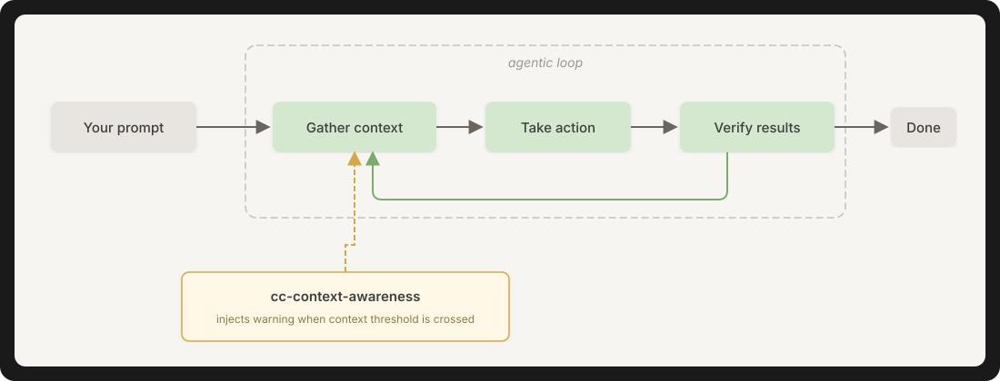

# cc-context-awareness

Configurable and monitor context window thresholds for [Claude Code](https://docs.anthropic.com/en/docs/claude-code). Injects instructions or run scripts when usage reaches specified thresholds.

<p align="center">
  
</p>

## Breaking Changes (v2.0.0)

Version 2.0.0 removes the Node.js CLI (`npx cc-context-awareness`), npm dependencies, and bundled workflow templates. The project now provides minimal hook scripts and a Claude Code plugin implemented in Bash and `jq`, following the structure of [cc-get-my-context](https://github.com/sdi2200262/cc-get-my-context).

## How It Works

Claude Code exposes context usage through `statusLine` data rather than hook payloads. This tool links three components:

1. **`bridge.sh` (`statusLine`)**: Reads the JSON payload Claude Code provides to the status line, extracts `used_percentage`, and writes the value to `/tmp/.cc-ctx-pct-${session_id}`. If piped to another command, it passes the original JSON through unchanged.
2. **`check-thresholds.sh` (`PreToolUse` hook)**: Reads the cached percentage before each tool call and compares it against configured thresholds. When usage reaches a threshold, it injects the threshold message as `additionalContext`.
3. **`reset.sh` (`SessionStart` hook)**: Clears cached percentage and state files on compaction (`matcher: "compact"`), then places a marker so the evaluator resets cleanly.

## Requirements

- [Claude Code](https://docs.anthropic.com/en/docs/claude-code)
- [`jq`](https://jqlang.github.io/jq/download/) (`brew install jq` on macOS or `sudo apt-get install jq` on Ubuntu)
- Bash 3.2+

## Installation

### Plugin

Install the plugin from Claude Code:

```bash
/plugin add sdi2200262/cc-context-awareness
```

The plugin registers the `PreToolUse` and `SessionStart` hooks automatically.

Configure `statusLine` in `~/.claude/settings.json` (global) or `./.claude/settings.local.json` (project):

```json
{
  "statusLine": {
    "type": "command",
    "command": "~/.claude/plugins/cache/cc-context-awareness/context-awareness/scripts/bridge.sh"
  }
}
```

If you use an existing status line tool (such as `ccstatusline`), pipe into it:

```json
{
  "statusLine": {
    "type": "command",
    "command": "~/.claude/plugins/cache/cc-context-awareness/context-awareness/scripts/bridge.sh | ccstatusline"
  }
}
```

### Manual

Clone or copy the scripts:

```bash
git clone https://github.com/sdi2200262/cc-context-awareness.git
mkdir -p ~/.claude/cc-context-awareness
cp -rL cc-context-awareness/plugins/context-awareness/scripts/* ~/.claude/cc-context-awareness/
chmod +x ~/.claude/cc-context-awareness/*.sh
```

Add the hooks and status line to `~/.claude/settings.json` (global) or `./.claude/settings.local.json` (project):

```json
{
  "statusLine": {
    "type": "command",
    "command": "~/.claude/cc-context-awareness/bridge.sh"
  },
  "hooks": {
    "PreToolUse": [
      {
        "matcher": ".*",
        "hooks": [
          {
            "type": "command",
            "command": "~/.claude/cc-context-awareness/check-thresholds.sh"
          }
        ]
      }
    ],
    "SessionStart": [
      {
        "matcher": "compact",
        "hooks": [
          {
            "type": "command",
            "command": "~/.claude/cc-context-awareness/reset.sh"
          }
        ]
      }
    ]
  }
}
```

## Configuration

Place configuration in `./.claude/cc-context-awareness/config.json` (project) or `~/.claude/cc-context-awareness/config.json` (global). If neither exists, the tool uses [`config.default.json`](file:///Users/cobuterman/Documents/Projects/General/cc-context-awareness/plugins/context-awareness/scripts/config.default.json).

Project settings take precedence over global settings.

```json
{
  "thresholds": [
    {
      "percent": 80,
      "level": "warning",
      "message": "Context window usage is at {percentage}% ({remaining}% remaining). Inform the user and suggest running /compact or completing the current task."
    }
  ],
  "repeat_mode": "once_per_tier_reset_on_compaction",
  "flag_dir": "/tmp"
}
```

### Reference

#### `thresholds`

| Field | Type | Description |
|---|---|---|
| `percent` | integer | Trigger percentage (0–100). |
| `level` | string | Unique name for the tier. |
| `message` | string | Injected message. Supports `{percentage}`, `{remaining}`, and `{session_id}`. |

#### `repeat_mode`

| Mode | Behavior |
|---|---|
| `once_per_tier_reset_on_compaction` | Fires once per tier. Resets if usage drops below the threshold (default). |
| `once_per_tier` | Fires once per session. Does not reset. |
| `every_turn` | Fires on every turn while usage remains above the threshold. |

#### `flag_dir`

Directory for session state files. Defaults to `/tmp`.

### Configuration Examples

#### Example: Automated Session Memory

This example illustrates how to maintain persistent notes across `/compact` events. It prompts Claude to write an initial checkpoint at 50% context, update progress at 65%, and finalize notes before suggesting compaction at 80%:

```json
{
  "thresholds": [
    {
      "percent": 50,
      "level": "memory-initial",
      "message": "Context window usage is at {percentage}%. Write an initial session checkpoint to .claude/session-memory.md covering current goals, completed steps, and active decisions."
    },
    {
      "percent": 65,
      "level": "memory-update",
      "message": "Context window usage is at {percentage}%. Update .claude/session-memory.md with recent file modifications, test results, and remaining work."
    },
    {
      "percent": 80,
      "level": "memory-final",
      "message": "Context window usage is at {percentage}% ({remaining}% remaining). Finalize .claude/session-memory.md with clear next steps, notify the user, and suggest running /compact."
    }
  ],
  "repeat_mode": "once_per_tier_reset_on_compaction",
  "flag_dir": "/tmp"
}
```

## Testing

Run the test suite:

```bash
./test/test.sh
```

The script tests manifest validity, percentage extraction, pipe pass-through, threshold evaluation, and compaction resets.

## License

MIT
